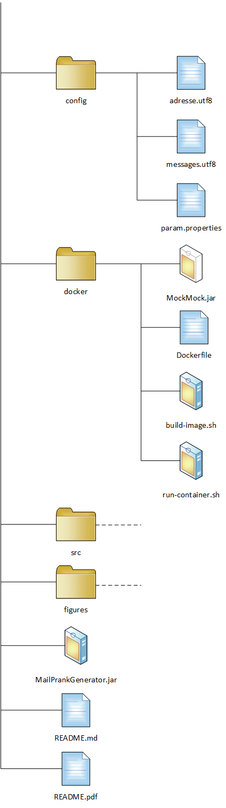
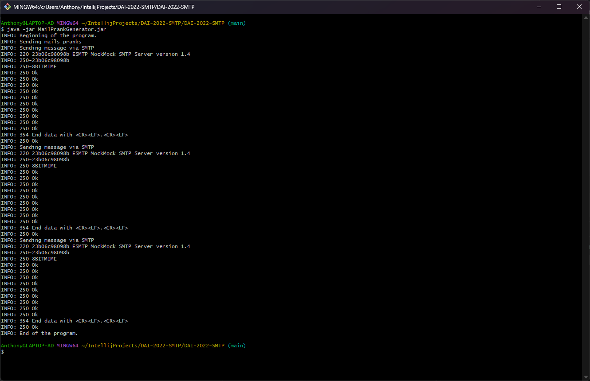
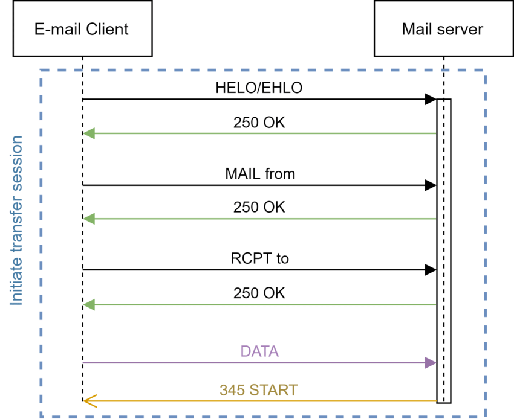

# Rapport laboratoire 4 - SMTP
Auteurs : Anthony David, Stéphane Nascimento Santos
Date : 08.12.2022

# 1. Introduction
Ce rapport concerne le laboratoire 4 du cours de DAI 2022-2023 de l'HEIG-VD.

Le but général de ce laboratoire est le développement d'une application client TCP en Java qui utilise l'API Socket afin de communiquer  avec un serveur SMTP.

Plus précisément, les objectifs sont les suivants :
1. Faire des expérience pratique pour se familiariser avec le protocole SMTP.
2. Comprendre les notions de test double et de serveur mock (serveur fictif).
3. Comprendre le protocole SMTP et être capable d'envoyer des messages électroniques en utilisant en travaillant directement avec l'API Socket.
4. Découvrir la simplicité d'envoi de faux e-mails qui semble avoir été envoyé par une personne autre qu'une personne malveillante.
5. Concevoir une application client orienté objet pour mettre en oeuvre une liste d'exigences spécifiques.

# 2. Description du projet
L'entier du projet se trouve sur GitHub à l'adresse suivante :

https://github.com/AnthonyDavid3110/DAI-2022-SMTP

Afin de pouvoir les différents outils développés dans le cadre de ce laboratoire, il suffit de forker le repository GitHub susmentionné et de le cloner sur la machine local. Une procédure décrivant ces démarches est disponible dans la documentation de GitHub :

https://docs.github.com/fr/get-started/quickstart/fork-a-repo

Une fois le fork et le clone effectué, on trouve sur notre machine un dossier avec l'arborescence suivante:

<p align="center">
     
</p>

Les fichiers README.md et README.pdf comprennent le présent rappport respectivement en format MarkDown et PDF.

Le fichier pom.xml est le fichier de configuration de Maven. Il est nécéssaire au bon fonctionnement de l'application mais il n'est pas nécéssaire de s'en préocuper pour utiliser paramétrer et utiliser l'application.

Le contenu des différents dossiers est exliqué ci-dessous :

## 2.1 Dossier config
Il contient les différents fichiers de configuration de notre application :
- `messages.utf8` qui contient des mails malicieux.
- `adresses.utf8` qui contient les adresse des personnes à piéger
- `param.properties` qui contient les paramètres de configuration

La modification de la configuration de notre application via la modification des ces fichiers est expliquée au [Point 4.2](#4.2 Paramétrage de l'application) de ce document.

## 2.2 Dossier docker
Le dossier `docker` contient les differnents fichier pour faire fonctionner un seveur fictif SMTP "MockMockServer" dans un container docker :

*To do : ajouter le schéma de l'arborescence*

- `Dockerfile` qui est le fichier de configuration du container docker
- `MockMock-1.4.1-SNAPSHOT.one-jar.jar` qui est l'exécutable java de l'application "MockMockServer".

- `build-image.sh` qui est un scripte pour le construction de l'image du container docker.
- `run-container.sh` qui est un scripte permettant de démarrer le container sur docker.

Une procédure d'utilisation complète du serveur fictif SMTP est dispnible au [Point 3.3](#3.3. Exécuter MockMockServer) de ce document.

3.3. Exécuter MockMockServer

## 2.3 Dossier src

Le dossier `src` contient tout le code source de application "MailPrankGenerator" développé en Java. Il contient différent sous-dossiers représentant les différents packages de l'application. 

Une description précise de l'implémentation du programme est faite au [Point 5](#5.-Description-de-l'implémentation) de ce document.

## 2.4 Dossier figures

Le dossier `figures` contient les différents médias (image, diagramme de classe, etc...) présent dans ce document. Le contenu n'est donc significatif à l'utilisation de l'application "PrankMailGenerator" ou au serveur "MockMockServer".

# 3. MockMock Server

## 3.1 Qu'est que MockMockServer

MockMockServer est une application multi-plateforme simulant un serveur SMTP développé en Java. L'application permet de tester si des e-mails sortants sont bien envoyés et de voir à quoi ils ressemblent. Il fournit une interface web qui affiche les courriels qui ont été envoyés et vous montre le contenu de ces courriels.

## 3.2 Pourquoi utiliser un serveur mock

Tester le fonctionnement d'une application sur un véritable serveur SMTP a plusieurs désavantages :

- Concrètement on a pas besoin de reçevoir les mails que notre application envoie sur un MUA (Mail User Agent) car ce qu'on va vouloir tester est uniquement l'envoi de nos mails.
- Il peut avoir un délai entre l'envoi et le récéption du mail ce qui peut rallonger consiédrablement le temps de dévelopement de notre application.
- A force d'envoyer bon nombre de mails sur un serveur, il y a des risque que le serveur ne nous permette pas l'envoi de mail pour des raions de sécurité (black list par exemle).

Du faites des différents inconvénients exposés ci-dessus, il est donc préférable d'utiliser un serveur fictif de type Mock (signifiant simulé en français).

## 3.3. Exécuter MockMockServer

Le répôt GitHub de l'application MockMockServer est disponible à l'adresse suivante :

https://github.com/DominiqueComte/MockMock

Ce qui permet d'aller voir comment est implémenté le programme. Cependant, un exécutable `.jar` est disonible dans le fork du projet décrit au point 2 de ce document dans le dossier `docker`.

Pour lancer l'application, il suffit d'effectuer la commande suivante dans le dossier docker :

```$ java -jar MockMock.jar -p 25 -h 8282 ```

Dans ce cas, le serveur SMTP aura comme port le 25 et l'application utilisera le port 8282 comme port http pour pouvoir se connecter sur l'interface web.

Si le serveur a bien démarré, le contenu de l'invité de commande devrait être similaire à la capture suivante :

<p align="center">
     
</p>
Pour se rendre sur l'interface web, l'adresse du serveur sera localhost (comme l'application tourne sur la machine) et le port 8282 comme mentionné ci-dessus :

```localhost:8282```

<p align="center">
     
</p>

A noter que lors d'envoi de mail sur MockMockServer, en plus d'être visile sur le l'interface web, il y a egalement une indication dans l'invité de commande où a été lancé le programme avec l'ajout d'une ligne tel que celle-ci :

<p style="background-color: black;color: white; font-family: Courier New">
    Email from joseph.lefebre@heig-vd.ch received.
</p>

## 3.4 Exécuter MockMockServer sur un container Docker

Il est également possible et fortement conseillé de faire fonctionner l'application dans un container docker.

Docker doit être installé est fonctionnel sur la machine hôte. Si ce n'est pas le cas, une procédure détaillée est disponible ici :

https://docs.docker.com/get-started/

Des scriptes sont à dispositions afin de faciliter la création de l'image ainsi que son déploiement. Par défaut, les ports utilisés sont les suivants :

SMTP = 25

HTTP = 8282

Pour modifier les ports, il faut modifier le scripte run-container.sh et remplacer les ports susmentionnés par ceux que l'on désire.

1) Lancer la construction de l'image :

   `./build-image.sh`
   
   Après l'exécution de la commande, l'invité de commande devrait être dans l'état suivant :
   
   <p align="center">
        
   </p>

2. Lancer le déploiement du container sur Docker:

   `./run-container.sh`

   Après l'exécution, notre invité de commande doit être dans l'état suivant :

   <p align="center">
        
   </p>

​	A noter qu'une fois l'application en fonctionnement, le comportement est le même qu'au point [3.3](#3.3.-Exécuter-MockMockServer). C'est-à-dire que lors de chaque mail reçu par le serveur Mock, une ligne sera ajouté dans l'invité de commande et que l'interfaceweb est disponible via localhost:port.

# 4. Mail Prank Generator

## 4.1 L'application Mail Prank Generator

L'application Mail Prank Generator va permettre d'envoyer des emails canulars à une liste de contact prédéfinie. 

Pour se faire, nous allons utiliser 

## 4.2 Paramétrage de l'application

Dans le dossier `param` se trouvant à la racine projet, se trouve 3 fichiers de configuration. Par défaut il sont configuration afin de pouvoir utiliser l'application sans les modifier mais il peuvent être adapté au besoin de l'utilisateur.

### 4.2.1 Configuration des messages à envoyer

Le fichier `param.properties` contient les paramètres de fonctionnement de l'application, soit :

- L'adresse de la machine `host=`

  Par défaut `localhost` car prêt pour une utilisation avec [MockMockServer](#3.-MockMock-Server).

- Le port SMTP du serveur `port=`

  Par défaut configuré sur `25` car prêt pour une utilisation avec [MockMockServer](#3.-MockMock-Server) configuré comme ci-dessus.

- Le nombre de groupe de victims `nbgroups=`

  Par défaut configuré à `3` groupes de victimes

Les valeurs contenues dans le fichiers peuvent être modifié avant chaque lancement de l'application.

### 4.2.2 Modifier de liste des victime

Le fichier `adresses.utf8` contient la listes des victimes et des faux expéditeurs de mail.

L'application est configuré pour créer automatiquement le nombre de groupe de victimes configuré dans le fichier `param.properties`

A noter que le nombre minimum d'adresses par groupe est de 3 au minimum (soit une adresse qui sera l'expéditeur et au minium 2 adresse qui reçevront le mail). Si le nombre d'adresse n'est pas suffisant, l'application en fonctionnera pas.

A noter également que l'application ajoute automatiquement une signature au mail avec le prénom et le nom de l'expéditeur (le même que l'adresse d'expédition) si, et uniquement si, elle arrive à déterminer le prénom et le nom depuis l'adresse e-mail. L'application peut le faire si l'adresse mail de l'expéditeur est sous le format `prenom.nom@...`. Dans le cas contraire, mail sera envoyé sans signature.

### 4.2.3 Modifier la liste des victimes

Dernier fichier de configuration, `messages.utf8` contient le sujet et le corps d'e-mails fictifs utilsé par l'application pour envoyer les canulars.

Il est donc possible de modifier /  ajouter des e-mails dans ce dossier.

Cependant, il est nécéssaire de respcéter les consignes suivantes :

- Chaque mail doit être séparé de la suite de caractère `==`.
- Chaque mail dans commençer par le sujet sous le formt `subject: {sujet du mail}`.
- Une ligne vide doit être laissée entre le sujet et le corps du mail.
- Les mails ne doivent pas être signées au risque de l'être doublement si l'application arriver à déterminer un prénom et un nom à partir de l'adresse mail de l'expéditeur du canular.

## 4.3 utilisation de l'application

Une fois les différents fichiers de configurations édités aux besoin, on peut trouver un fichier exécutable `MailPrankGenerator.jar` la racine du projet.

Etant donné que l'application retourne dans le terminal un état des lieux des différentes interractions faites avec les serveur, il est fortement recommandé de lancer l'application depuis un terminal afin de pouvoir s'assurer du bon fonctionnement de l'application.

Il suffit donc de lancer l'application avec la commande :

`java -jar MailPrankGenerator.jar`

<p align="center">
     
</p>

Si on reçoit en retour uniquement les `INFO: {...}`et que le programme termine par la ligne :

<p style="background-color: black;color: white; font-family: Courier New">
	INFO: End of the program.
</p>

C'est que tout s'est passé comme escompté.

# 5. Description de l'implémentation

## 5.1 Diagramme de classe


<p align="center">
     
</p>


## 5. 2 Explications sur l'implémentation

On peut découper notre application en 3 grandes parties que sont :

- La gestion des paramètres
- La modélisation des canulars et des informations nécéssaires
- L'envoi des canulars via SMTP

Nous avons opté pour une solution ou chacun de ces parties était intégré à un package afin de structuer notre de manière optimale et de permettre la réutilsation d'une partie de celui-ci. On pourrait par exemple imaginer réutiliser la gestion des paramètres dans une autre application qui enverrai autre chose que des pranks.

A noter que la conception de l'application se base grandement sur les vidéos du cours de DAI :

https://www.youtube.com/watch?v=ot-bDyqgTtk

https://www.youtube.com/watch?v=Nj34XicS6JM

https://www.youtube.com/watch?v=LoFKsT9Rj10

https://www.youtube.com/watch?v=OrSdRCt_6YQ

La structure de notre programme en est grandement inspiré et des informations complémentaire sur l'implémentation du client peuvent être trouvées sur les vidéos si elle serait manquante ou insuffisamment précise dans ce présent document.

### 5.2.1 Gestion des paramètres

Comme expliqué précédemment dans ce document, les propriétés, les mails à envoyer ainsi que les addresses sont stockés dans 3 fichiers de configuration qu'il est possible de modifier sans avoir à le faire dans le code Java de l'application.

Afin d'aller lire les paramètres stockés dans ces fichiers, nous avons implémenter un package `config` implémentant une Classe `ConfigurationManager` Permettant d'aller lire et de charger les informations dans les fichiers de configuration.

A noter l'implémentation d'un contrôle de la bonne forme des adresse mail faisant stopper le programme si une adresse mail n'est pas dans un format adéquoit.

### 5.2.2 Modélisation

Pour ce qui est de la modélisation, nous avons décidé de séparer encore en dous sous-package :

**mail**

Comprenant une classe `Groupe`, une classe `Message`, et une classe `Person`modélisant respectivement un objet du type dont il portent le nom.

A noter l'implémentation d'un getter supplémentaire sur le Subject retournant ce dernier encodé en Base64. Il est nécéssaire d'avoir cette encodage du sujet du mail lors de l'envoi.

A noter que lors de la création d'une personne, si le mail est de format `prénom.nom@...` il va récupérer le prénom et le nom de la personne. ce qui lui permettra lors de la création du prank d'ajouter une signature au mail avec le même prénom et le même nom que dans l'adresse mail, ce qui augemente la crédibilité de notre prank.

**Prank**

Modélisant le canular en lui-même et offrant les méthodes nécéssaire à la création de ces derniers.

### 5.2.3 Partie SMTP

Interface et classe permettant l'envoi de nos pranks via l'API Socket au serveur SMTP.

### 5.2.5. App

Finalement, nous avons le fichier App.java qui contient la fonctions `main()`principale du programme.

## 5.3 Communication avec le serveur

Comme évoqué ci-dessus, le client utilise le procole TCP et l'API Socket afin de communiquer avec le serveur SMTP.

La communication avec un serveur SMTP fonctionne de manière relativement simple puisqu'il va répondre à une suite de commande précise que le client va lui envoyer.

Schématiquement la conversation peut vue comme ça :

<p align="center">
     
</p>

Les commandes utilisée dans l'application sont les suivante :

- `EHLO` permet au client de se présenter au serveur
- `MAIL FROM` permet au client d'indiquer l'adresse de l'expéditeur
- `RCPT TO` permet au client d'indiquer l'adresse du/des réceptionnaires du mail
- `DATA `permet d'envoyer respectivement les en-êtes et le corps du mail

Le serveur répond à chaque fois par un code afin que le client puisse s'assurer que tout s'est bien passé (par exemple `250 OK` si tout est bon pour le serveur).

### 5.3.1 Exemple de communication client-serveur SMPT

Indications : 

- `s` pour server 
- `c`pour client
- Communication entre l'application `MailPrankGenerator` et un serveur `MockMockServer`configuré sur le`port=25` démarré sur la machine local `host=localhost`.

    S: 220 23b06c98098b ESMTP MockMock SMTP Server version 1.4
    C: EHLO localhost 
    S: 250-23b06c98098b
    S: 250-8BITMIME
    S: 250 Ok
    C: MAIL FROM: Teresa.Martin@hotmail.com
    S: 250 OK
    S: RCPT TO: John.Benjamin@yahoo.com
    S: 250 OK
    S: RCPT TO: Susan.Stevens@gmail.com
    S: 250 OK
    S: RCPT TO: Debbie.Stewart@yahoo.com
    S: 250 OK
    C: DATA
    S: 354 End data with <CR><LF>.<CR><LF>
    C: Content-Type: text/plain; charset=utf-8
    C: From: Teresa.Martin@hotmail.com
    C: To: John.Benjamin@yahoo.com 
    C: , Susan.Stevens@gmail.com
    C: , Debbie.Stewart@yahoo.com
    C: Subject: =?utf-8?B?R8OpbmlhbCBjb25jZXJ0IGR1IEfDqW5pYWwgZ3JvdXBlICJnw6luw6lyaXF1JiIgIQ==?=
    C: Salut !
       J'espère que tu vas bien !
       Je sais pas si tu as vu mais le fanfare d'Yvonand donne prochaine son concert annuel. Ca te dirais de venir avoir moi ?
    
       A+
    C: .
    C:
    S: 250 OK
    C: QUIT
    S: 221 Bye

# 6. Conlusion

Après avoir effectué ce laboratoire, nous avons compris le concept de communication avec un serveur SMTP et comment implémenter une solution simple de client pouvant le faire.

Ce laboratoire nous a aussi permis de nous familiariser par la pratique avec l'environnement Docker ce qui a été fort appréciable.
