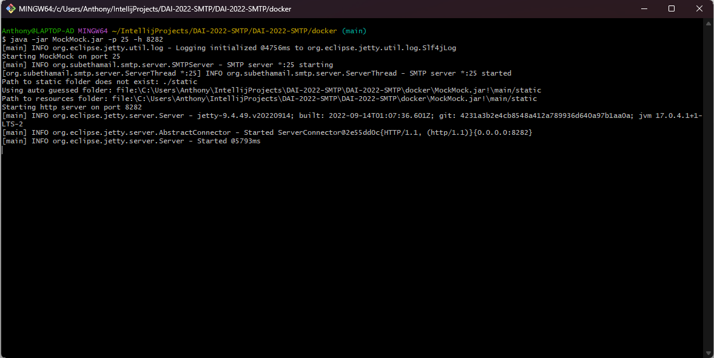
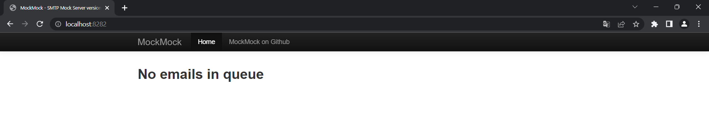
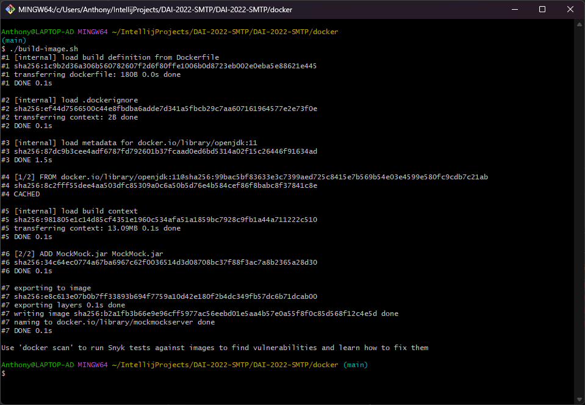
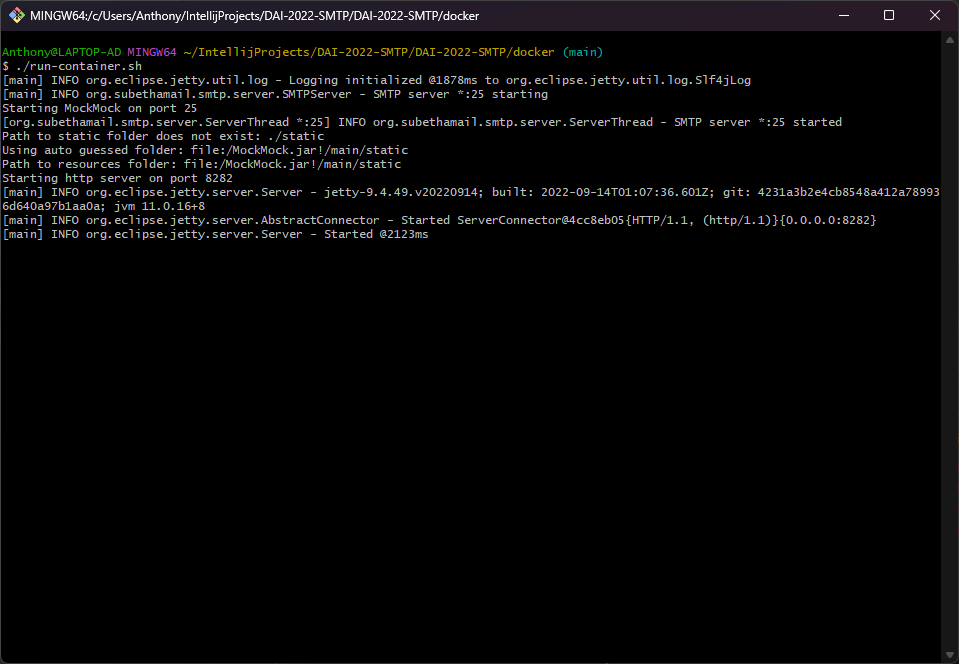
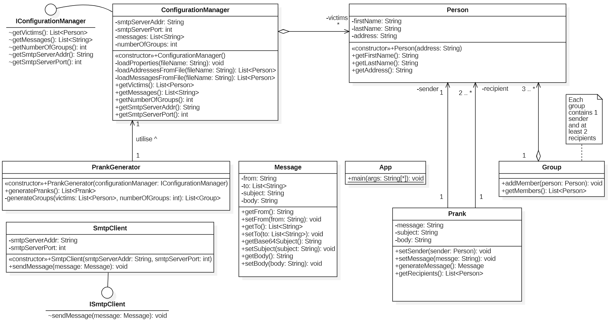

# Rapport laboratoire 4 - SMTP
Auteurs : Anthony David, Stéphane Nascimento Santos
Date : 08.12.2022

# 1. Introduction
Ce rapport concerne le laboratoire 4 du cours de DAI 2022-2023 de l'HEIG-VD.

Le but général de ce laboratoire est le développement d'une application client TCP en Java qui utilise l'API Socket afin de communiquer  avec un serveur SMTP.

Plus précisément, les objectifs sont les suivants :
1. Faire des expérience pratique pour se familiariser avec le protocole SMTP.
2. Comprendre les notions de test double et de serveur mock (serveur fictif).
3. Comprendre le protocole SMTP et être capable d'envoyer des messages électroniques en utilisant en travaillant directement avec l'API Socket.
4. Découvrir la simplicité d'envoi de faux e-mails qui semble avoir été envoyé par une personne autre qu'une personne malveillante.
5. Concevoir une application client orienté objet pour mettre en oeuvre une liste d'exigences spécifiques.

# 2. Description du projet
L'entier du projet se trouve sur GitHub à l'adresse suivante :

https://github.com/AnthonyDavid3110/DAI-2022-SMTP

Afin de pouvoir les différents outils développés dans le cadre de ce laboratoire, il suffit de forker le repository GitHub susmentionné et de le cloner sur la machine local. Une procédure décrivant ces démarches est disponible dans la documentation de GitHub :

https://docs.github.com/fr/get-started/quickstart/fork-a-repo

Une fois le fork et le clone effectué, on trouve sur notre machine un dossier avec l'arborescence suivante:

*To do  :  Ajouter schéma arbo*

Les fichiers README.md et README.pdf comprennent le présent rappport respectivement en format MarkDown et PDF.

Le fichier pom.xml est le fichier de configuration de Maven. Il est nécéssaire au bon fonctionnement de l'application mais il n'est pas nécéssaire de s'en préocuper pour utiliser paramétrer et utiliser l'application.

Le contenu des différents dossiers est exliqué ci-dessous :

## 2.1 Dossier config
Il contient les différents fichiers de configuration de notre application :
- `messages.utf8` qui contient des mails malicieux.
- `adresses.utf8` qui contient les adresse des personnes à piéger
- `param.properties` qui contient les paramètres de configuration

La modification de la configuration de notre application via la modification des ces fichiers est expliquée au point 5 de ce document.

## 2.2 Dossier docker
Le dossier `docker` contient les differnents fichier pour faire fonctionner un seveur fictif SMTP "MockMockServer" dans un container docker :

*To do : ajouter le schéma de l'arborescence*

- `Dockerfile` qui est le fichier de configuration du container docker
- `MockMock-1.4.1-SNAPSHOT.one-jar.jar` qui est l'exécutable java de l'application "MockMockServer".

- `build-image.sh` qui est un scripte pour le construction de l'image du container docker.
- `run-container.sh` qui est un scripte permettant de démarrer le container sur docker.

Une procédure d'utilisation complète du serveur fictif SMTP est dispnible au point 3. de ce document.

## 2.3 Dossier src

Le dossier `src` contient tout le code source de application "MailPrankGenerator" développé en Java. Il contient différent sous-dossiers représentant les différents packages de l'application. 


Une description précise de l'implémentation du programme est faite au point 5 de ce document.

## 2.4 Dossier figures

Le dossier `figures` contient les différents médias (image, diagramme de classe, etc...) présent dans ce document. Le contenu n'est donc significatif à l'utilisation de l'application "PrankMailGenerator" ou au serveur "MockMockServer".

# 3. MockMock Server

## 3.1 Qu'est que MockMockServer

MockMockServer est une application multi-plateforme simulant un serveur SMTP développé en Java. L'application permet de tester si des e-mails sortants sont bien envoyés et de voir à quoi ils ressemblent. Il fournit une interface web qui affiche les courriels qui ont été envoyés et vous montre le contenu de ces courriels.

## 3.2 Pourquoi utiliser un serveur mock

Tester le fonctionnement d'une application sur un véritable serveur SMTP a plusieurs désavantages :

- Concrètement on a pas besoin de reçevoir les mails que notre application envoie sur un MUA (Mail User Agent) car ce qu'on va vouloir tester est uniquement l'envoi de nos mails.
- Il peut avoir un délai entre l'envoi et le récéption du mail ce qui peut rallonger consiédrablement le temps de dévelopement de notre application.
- A force d'envoyer bon nombre de mails sur un serveur, il y a des risque que le serveur ne nous permette pas l'envoi de mail pour des raions de sécurité (black list par exemle).

Du faites des différents inconvénients exposés ci-dessus, il est donc préférable d'utiliser un serveur fictif de type Mock (signifiant simulé en français).

## 3.3. Exécuter MockMockServer

Le répôt GitHub de l'application MockMockServer est disponible à l'adresse suivante :

https://github.com/DominiqueComte/MockMock

Ce qui permet d'aller voir comment est implémenté le programme. Cependant, un exécutable `.jar` est disonible dans le fork du projet décrit au point 2 de ce document dans le dossier `docker`.

Pour lancer l'application, il suffit d'effectuer la commande suivante dans le dossier docker :

```$ java -jar MockMock.jar -p 25 -h 8282 ```

Dans ce cas, le serveur SMTP aura comme port le 25 et l'application utilisera le port 8282 comme port http pour pouvoir se connecter sur l'interface web.

Si le serveur a bien démarré, le contenu de l'invité de commande devrait être similaire à la capture suivante :

<p align="center">
     
</p>


Pour se rendre sur l'interface web, l'adresse du serveur sera localhost (comme l'application tourne sur la machine) et le port 8282 comme mentionné ci-dessus :

```localhost:8282```

<p align="center">
     
</p>


A noter que lors d'envoi de mail sur MockMockServer, en plus d'être visile sur le l'interface web, il y a egalement une indication dans l'invité de commande où a été lancé le programme avec l'ajout d'une ligne tel que celle-ci :

<p style="background-color: black;color: white; font-family: Courier New">
    Email from joseph.lefebre@heig-vd.ch received.
</p>

## 3.4 Exécuter MockMockServer sur un container Docker

Il est également possible et fortement conseillé de faire fonctionner l'application dans un container docker.

Docker doit être installé est fonctionnel sur la machine hôte. Si ce n'est pas le cas, une procédure détaillée est disponible ici :

https://docs.docker.com/get-started/

Des scriptes sont à dispositions afin de faciliter la création de l'image ainsi que son déploiement. Par défaut, les ports utilisés sont les suivants :

SMTP = 25

HTTP = 8282

Pour modifier les ports, il faut modifier le scripte run-container.sh et remplacer les ports susmentionnés par ceux que l'on désire.

1) Lancer la construction de l'image :

   `./build-image.sh`
   
   Après l'exécution de la commande, l'invité de commande devrait être dans l'état suivant :
   
   <p align="center">
        
   </p>

2. Lancer le déploiement du container sur Docker:

   `./run-container.sh`

   Après l'exécution, notre invité de commande doit être dans l'état suivant :

   <p align="center">
        
   </p>

​	A noter qu'une fois l'application en fonctionnement, le comportement est le même qu'au point [3.3](#3.3.-Exécuter-MockMockServer). C'est-à-dire que lors de chaque mail reçu par le serveur Mock, une ligne sera ajouté dans l'invité de commande et que l'interfaceweb est disponible via localhost:port.

# 4. Mail Prank Generator

## 4.1 L'application Mail Prank Generator

## 4.2 Paramétrage de l'application

## 4.3 utilisation de l'application


# 5. Description de l'implémentation
## 5.1 Diagramme de classe
<p align="center">
     
</p>

TODO : ajouter diagramme de classe

## Explications sur l'implémentation

### 5.2.1 Gestion des paramètres

### 5.2.2 Partie de modélisation

### 5.2.3 Partie des canular

### 5.2.4 Partie SMTP

# 6. Conlusion
